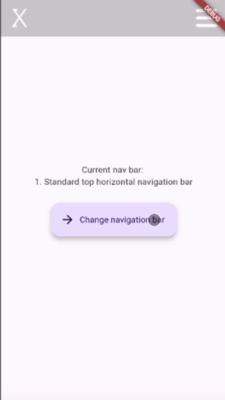

# Flutter Nav Bars

## About

- In this project I have played around with different types of navigation bars, whilst keeping the style consistent throughout
- Each navigation bar is a standalone widget that can be copy and pasted to any project. Just make sure that you copy the images to your project, add the triangle_painter.dart file for the slanted nav bars and add any required packages

### Desktop dimension

### Mobile dimension

